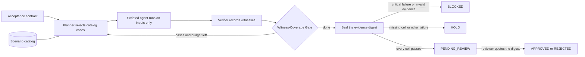

<p align="center"></p>

# ASTERION
### Evidence-linked deployment rehearsals for enterprise agents

**A perfect demo score is not a customer handoff.** ASTERION converts a customer acceptance contract into bounded operational rehearsals, verifies obligation-linked evidence, and produces a digest-bound human-review capsule.

[](https://github.com/gandhiashutosh14/asterion-rehearsal/actions/workflows/ci.yml)   

**Maturity:** working local research/engineering prototype. **Default:** no API key, synthetic fixtures, no cloud writes. **Framework:** a native LangGraph engine that shares its domain nodes with the default reference runner. **License:** MIT.

**Verified before publishing (2026-09-17, Windows 11, Python 3.11):** 73 tests passed with none skipped, including the native LangGraph interrupt/resume tests, at 94% line and branch coverage. The four case studies below reproduced with byte-identical evidence digests. The HTTP API passed a 10-check smoke test under uvicorn, and the built wheel ran outside the source tree. On GitHub Actions the same suite passes on Python 3.11 to 3.13 with no skips, the Docker image builds and serves `/healthz` from a read-only container, and the AWS Terraform passes `fmt` and `validate`. Nothing has been deployed. The original packaging sandbox had recorded 70 passed with the LangGraph module skipped. [Records, commands and limits](reports/verification/README.md).

[Start here](START_HERE.md) · [Architecture](docs/ARCHITECTURE.md) · [Visual atlas](docs/DIAGRAMS.md) · [Measured results](reports/reference/README.md) · [Verification scope](docs/IMPLEMENTATION_STATUS.md) · [Engineering handoff](AGENTS.md)

> **In plain English:** Before a company lets an artificial intelligence (AI) agent act for its customers, both sides need evidence. The agent must behave safely when things go wrong, not just on a good day. Both sides also need a sign-off tied to the exact evidence that was reviewed. ASTERION turns a customer's requirements into small failure drills, never counts an untested requirement as passed, and ties approval to a fingerprint of the evidence. It is a tested local prototype on synthetic data; nothing has been deployed.
>
> **Reading guide:** business readers can read the next three sections, then jump to [SWOT](#swot-analysis) and [where this applies](#where-this-applies). Engineers can go straight to [The 30-second demonstration](#the-30-second-demonstration).

## The problem in plain English

Northstar Distribution, an invented company in this repository's case study, wants an AI support agent that resolves order questions. The agent must check two business systems: the CRM (customer relationship management, where customer records live) and the ERP (enterprise resource planning, where orders and stock live). In a demo, the agent handles two routine questions perfectly.

The customer's operations lead asks harder questions. What happens when the ERP is down? When a record is out of date? When the same event arrives twice? When a record belongs to a different customer? A single pass rate cannot answer these, because the routine demo never ran those cases. In this repository's own results, a happy-only suite (routine cases only) scores 100% while covering only 1 of the 12 required cells. A cell is one requirement tested in one situation ([measured results](reports/reference/README.md)).

Sign-off has a second gap. A reviewer approves a report, but nothing links that approval to the exact evidence inside it. If the evidence changes later, the old approval can still look valid. ASTERION makes the reviewer quote an evidence digest, a SHA-256 (Secure Hash Algorithm) fingerprint of the sealed results. If the evidence has changed, the digest no longer matches and the approval is refused.

This is the seam a forward-deployed engineer (FDE) owns: turning a customer's loose idea of "resolve correctly" into written, testable obligations with named owners ([engagement brief](docs/fde/ENGAGEMENT_BRIEF.md)).

## Executive summary

| Question | Answer |
|---|---|
| What problem does this address? | Showing, before go-live, that an enterprise AI agent handles the failure cases a customer cares about, and recording who accepted which evidence. |
| Who has this problem? | Forward-deployed and solutions engineers, customer operations leaders, security reviewers and delivery managers at companies that put AI agents into customer systems, and the enterprise customers who must accept those agents. |
| What does this repository do? | It turns an acceptance contract into bounded failure rehearsals and checks each result against separately written expected outcomes. It blocks or holds any run with failed or missing evidence, and binds human approval to an evidence digest. |
| What has been shown so far? | Four synthetic case studies ([results](reports/reference/README.md)). A deliberately flawed "optimistic" agent covers all 12 required cells, but only 23.1% of its witnesses pass, so it is BLOCKED. A "guarded" agent passes every cell and reaches PENDING_REVIEW. Happy-only suites score 100% but cover 1 of 12 cells, so they are put on HOLD. 73 tests pass with none skipped, at 94% line and branch coverage ([verification records](reports/verification/README.md)). |
| How mature is it? | A local prototype on synthetic fixtures, verified on Windows and on GitHub Actions for Python 3.11 to 3.13. Nothing has been deployed ([verification scope](docs/IMPLEMENTATION_STATUS.md)). |
| What it is not | Not a measure of model quality, a reliability probability, a certification or a production platform. The agents under test are scripted policies, not language models, and the note-handling case is not a prompt-injection study ([threat model](docs/THREAT_MODEL.md)). |
| What it would take to use it for real | One read-only adapter to a customer sandbox, with expected outcomes reviewed by someone other than its author. Then single sign-on (SSO), a job queue, a managed database and a controlled pilot ([engagement brief](docs/fde/ENGAGEMENT_BRIEF.md), [cloud target](docs/CLOUD_ARCHITECTURE.md)). |

## How it works, end to end



1. **Agree what "ready" means.** The customer and the engineer write an acceptance contract with nine obligations, each with a named owner. The obligations are tested across 12 required cells, such as ERP outage, stale data, duplicate event and tenant boundary ([`contract.synthetic.yaml`](src/asterion/data/contract.synthetic.yaml)).
2. **Pick the drills.** A bounded planner picks up to four cases per round from a fixed catalog of 13, critical obligations first. It can only choose existing case IDs; unknown IDs are dropped ([`planning.py`](src/asterion/planning.py)).
3. **Rehearse.** A scripted agent runs each case against in-process CRM and ERP fixtures. It sees the case inputs, never the expected answers, and nothing touches a real system ([`twin.py`](src/asterion/twin.py)).
4. **Verify.** A separate verifier compares the output with the expected outcomes and records a witness, pass or fail. Each witness is tied to the contract, the case, the agent version and the run ([`evidence.py`](src/asterion/evidence.py)).
5. **Gate.** The Witness-Coverage Gate marks each required cell PASS, FAIL or MISSING. Repeating a routine case cannot fill an outage cell. The loop continues while unrun cases and round limits remain ([`workflow.py`](src/asterion/workflow.py)).
6. **Seal.** The contract, request, witnesses, observations and verdict are hashed into one evidence digest and exported as JSON, Markdown, HTML and an event log. A critical failure gives BLOCKED, a gap gives HOLD, and full passing coverage gives PENDING_REVIEW ([`reporting.py`](src/asterion/reporting.py)).
7. **Review.** A reviewer approves or rejects by quoting the digest. The ledger recomputes it first, so changed or stale evidence is refused ([`storage.py`](src/asterion/storage.py)). With the native LangGraph engine, the run waits in `interrupt()` until a separate process resumes it ([`langgraph_runtime.py`](src/asterion/langgraph_runtime.py)).

**Worked example.** The "optimistic" agent always reports a case as resolved, without checking outages, freshness, identity or tenant ([`twin.py`](src/asterion/twin.py)). Here is its CRM-outage case from [`reports/reference/optimistic-complete/report.md`](reports/reference/optimistic-complete/report.md):

| Field | Expected | Observed |
|---|---|---|
| `decision` | `needs_information` | `resolved` |
| `claim_completed` | `false` | `true` |
| `effect_count` | `0` | `1` |

The agent claimed a completed resolution, and recorded a synthetic action, while the CRM was unavailable. It fails 10 of the 12 required cells, so the run is BLOCKED even though coverage is 100%. The "guarded" agent passes all 12 cells and stops at PENDING_REVIEW with evidence digest `2acb7a0ebd1a…` ([report](reports/reference/guarded-complete/report.md)). It can reach APPROVED only when a reviewer approves and quotes that digest.

## The 30-second demonstration

Two routine cases pass. Is the customer ready?

| Scripted target | Suite | Required-cell coverage | Observed witness pass rate | Handoff state |
|---|---|---:|---:|---|
| Optimistic | Happy-only | 1 / 12 | 100% | **HOLD** |
| Optimistic | Complete | 12 / 12 | 23.1% | **BLOCKED** |
| Guarded | Happy-only | 1 / 12 | 100% | **HOLD** |
| Guarded | Complete | 12 / 12 | 100% | **PENDING_REVIEW** |

These are **executed synthetic case-study results**, not model accuracy, production reliability, customer savings or an autonomous deployment claim. The optimistic policy is intentionally flawed; the guarded policy implements the authored contract. See [reproduction and source hashes](reports/reference/summary.json).

The central mechanism is the **Witness-Coverage Gate**: a passing normal example cannot discharge an untested outage, freshness, duplicate-event or tenant-boundary obligation. Missing evidence stays missing.


## Run locally

Python 3.11+ is required. A fresh installation needs package-registry access; subsequent reference runs need no network or model key.

```bash
git clone https://github.com/gandhiashutosh14/asterion-rehearsal.git
cd asterion-rehearsal
python -m venv .venv
# Linux/macOS: source .venv/bin/activate
# Windows PowerShell: .venv\Scripts\Activate.ps1
python -m pip install -e ".[api,dev]"
python scripts/demo.py demo
python scripts/benchmark.py --output artifacts/benchmark
python -m pytest -q
python scripts/api_smoke.py        # starts the API under uvicorn on 127.0.0.1, checks it, stops it
```

`scripts/benchmark.py` without `--output` rewrites the committed reference reports under `reports/reference/`; write to `artifacts/` to compare instead.

Open `artifacts/latest/report.html` for your new dossier. For an immediate, installation-free tour, open **`site/index.html`** in a browser; it uses bundled measured reports and does not execute an agent.

To expose the core counterexample:

```bash
python scripts/demo.py demo --suite happy-only --output artifacts/happy-only
python scripts/demo.py demo --profile optimistic --output artifacts/blocked
```

A complete guarded run returns a run ID and evidence digest. Review that exact run with:

```bash
python scripts/demo.py review RUN_ID --digest EVIDENCE_DIGEST --decision approve --rationale "Reviewed the synthetic acceptance evidence"
```

`RUN_ID` and `EVIDENCE_DIGEST` are operator inputs copied from the preceding run, not literal values. Approval changes the local rehearsal status. It never deploys an application or writes to a customer system.

## Native LangGraph mode

```bash
python -m pip install -e ".[api,dev,agent]"
python -m pytest tests/test_langgraph_integration.py -q
python scripts/demo.py demo --engine langgraph --output artifacts/langgraph
```

The adapter uses `StateGraph`, SQLite checkpoints, a conditional bounded rehearsal loop, `interrupt()` and `Command(resume=...)`. The reference runner and framework adapter share the same domain nodes. The three framework tests run in GitHub CI and passed locally on 2026-09-17. In a local CLI run, the LangGraph engine stopped at `PENDING_REVIEW`, and a separate `review` process resumed the interrupt to `APPROVED`. Its cells, witnesses, observations and final status matched a reference-engine run ([log](reports/verification/2026-09-17-local-windows/cli-flows.txt)). The original packaging sandbox could not install LangGraph and skipped these tests.

An optional Bedrock proposer selects allowed scenario IDs. Install `.[cloud]`, configure an enabled Converse-compatible model using `ASTERION_BEDROCK_MODEL_ID` and `AWS_REGION`, then add `--planner bedrock`. This can incur charges. Live inference was not run; SDK serialization was tested using a fake client. The synchronous API intentionally refuses live model planning.

## System architecture


| Component | Responsibility | Code |
|---|---|---|
| Integration Cartographer | Record declared synthetic CRM/ERP context | `workflow.discover` |
| Scenario Architect | Propose bounded catalog IDs, reject invented cases | `planning.py` |
| Rehearsal Fabric | Exercise input-only scripted targets over fixtures | `twin.py` |
| Independent verifier | Compare observations with separate curated checks | `evidence.py` |
| Witness-Coverage Gate | Evaluate coverage, missing cells and counterexamples | `evidence.assess` |
| Handoff Seal | Bind human review to an unchanged evidence payload | `workflow.seal`, `storage.review` |

The subsystem names identify responsibilities, not six independent LLM agents. The architecture deliberately uses one bounded planner/executor/verifier flow rather than unnecessary agent debate.

## Why this is an FDE artifact

The repository covers the customer-delivery seam: discovery questions, explicit acceptance, integration failure semantics, concrete reproduction, reviewer ownership and operational handoff. The [engagement kit](docs/fde/ENGAGEMENT_BRIEF.md), [acceptance workbook](docs/fde/ACCEPTANCE_WORKBOOK.md), [RACI](docs/fde/RACI.md), [ADRs](docs/adr/README.md) and [runbook](docs/RUNBOOK.md) make the engineering discussion inspectable.

AWS/Azure diagrams are **reference targets**, not deployed services. [AWS Terraform](infra/aws/README.md) supplies only registry/evidence/IAM foundation resources. The working local API uses server-mapped bearer principals, SQLite and stored-journal SSE replay, not SSO, a production queue or live token streaming.

## Included assets

Eight architectural plates, each as editable SVG and high-resolution PNG, plus Mermaid source. A branded hero, a local interactive report explorer, actual browser screenshots, typed JSON schemas/OpenAPI, case-study reports, security/operations documents, Docker recipes and CI workflows are included. Start with the [visual atlas](docs/DIAGRAMS.md). The screenshots were captured in the packaging environment on 2026-09-16; `site/index.html` is unchanged since then.

## Claims and limitations

The gate demonstrates finite, explicitly authored acceptance coverage. It is not a reliability probability, formal proof, patentability opinion or certification. Hashes detect changed content; they do not authenticate a malicious evaluator. The model never sees golden expected values, but all catalog data is public and was authored for this project. No real customer data, employer source, credential or outreach tracker is bundled.

This project is distinct from rule-change decision replay, schema-drift repair, resource scheduling, general multi-judge evaluation and infrastructure root-cause diagnosis. Its unit of value is a **customer-specific deployment handoff capsule**.

## Repository map

```text
src/asterion/       Typed contracts, planning, fixtures, gate, ledger, API, LangGraph
src/asterion/data/  Synthetic contract and independently authored expected checks
tests/             Core, API, persistence and optional native-framework tests
scripts/           Demo, benchmark, API smoke test, dossier verifier, schema/site/diagram generators
reports/           Reference case-study results with source hashes; dated verification records
assets/            Editable vector diagrams, raster exports and browser captures
site/              Offline interactive case-study explorer
schemas/           JSON Schema and OpenAPI exports
docs/              Architecture, research, security, operations and FDE delivery kit
infra/aws/         Unapplied foundation Terraform (not a full service deployment)
.github/workflows/ Tests and packaging on every push; Terraform checks on infra changes; manual container/image workflows
AGENTS.md          Bounded continuation and publication instructions for coding agents
```

## Sources and authorship

See [sources](docs/SOURCES.md) for official framework/cloud references and readiness-review prior art. See [development notes](docs/DEVELOPMENT_NOTES.md) for what was checked, fixed and changed before publication. Part of Ashutosh Gandhi's independent portfolio; no company endorsement or production adoption is implied.

## SWOT analysis

A SWOT analysis lists **S**trengths and **W**eaknesses (inside the project) and
**O**pportunities and **T**hreats (outside it).

| | Helpful | Harmful |
|---|---|---|
| **Internal** | **Strengths**<br>• Keeps coverage and pass rate apart, so a perfect score on routine cases cannot hide untested failure modes ([results](reports/reference/README.md)).<br>• Approval is bound to a recomputed evidence digest. A stale digest was refused in a recorded command-line run ([`cli-flows.txt`](reports/verification/2026-09-17-local-windows/cli-flows.txt)).<br>• Reproducible: the four case studies gave byte-identical digests on Linux and Windows, and 73 tests pass with none skipped on Python 3.11 to 3.13.<br>• Expected outcomes are kept away from the agent under test, and model suggestions cannot invent cases, add tools or authorize deployment ([architecture](docs/ARCHITECTURE.md)).<br>• Comes with a delivery kit, not just code: engagement brief, acceptance workbook, RACI (responsibility) chart, decision records and runbook. | **Weaknesses**<br>• Synthetic only: an invented customer, in-process fixtures and scripted agents. No language model is evaluated, and the optional Amazon Bedrock planner was never called live.<br>• Coverage is coarse: one passing case can satisfy a cell, and failures that need two conditions at once are not generated ([research note](docs/RESEARCH_NOTE.md)).<br>• Local-first design: a SQLite ledger transaction stays open for each whole run, and there is no queue or SSO. It is not fit for concurrent multi-tenant use ([architecture](docs/ARCHITECTURE.md)).<br>• Hashes detect changed evidence but do not show who produced it, and there is no signed attestation ([threat model](docs/THREAT_MODEL.md)).<br>• Cloud work is design-only: the Terraform passed validation but was never planned or applied, and the Docker image was built only on GitHub Actions. |
| **External** | **Opportunities**<br>• Risk frameworks such as the AI Risk Management Framework from the US National Institute of Standards and Technology (NIST) include evaluation of AI systems. A sealed rehearsal dossier is a concrete, reviewable record of one.<br>• Readiness reviews and chaos experiments are established practice for online services; this extends them to AI agent handoffs.<br>• The same contract could be run against a real language-model agent in a sandbox, using the study design in the [research note](docs/RESEARCH_NOTE.md).<br>• A versioned contract could become a shared artifact between vendor and customer, re-accepted whenever the agent changes. | **Threats**<br>• Agent platforms and evaluation vendors ship their own testing and approval tooling.<br>• Fixture results may not transfer: real outages, rate limits, token expiry and cross-process duplicates need integration tests ([acceptance workbook](docs/fde/ACCEPTANCE_WORKBOOK.md)).<br>• A well-kept static checklist that covers every required cell can reach the same verdicts, which limits any novelty claim ([research note](docs/RESEARCH_NOTE.md)).<br>• Outside interfaces keep changing: LangGraph's interrupt behavior and the Bedrock Converse API are beyond the project's control.<br>• A green dossier could be mistaken for a safety certification, which the repository says it is not. |

**In short:** the gate and the digest-bound review work as described on authored fixtures. Nothing yet shows how they perform with a real agent or a real customer.

## Where this applies

These are illustrative examples of where the approach fits. None of them is a deployment of this code.

| Industry | Example use case | What this project's approach contributes |
|---|---|---|
| Enterprise software vendors | Handing a support-resolution agent over to a new customer | A versioned acceptance contract, a named owner per obligation, and a sealed dossier for sign-off. |
| Distribution and logistics | An order-status agent that reads CRM and ERP records, as in the synthetic case | Outage, stale-data, identity-conflict and duplicate-event drills before go-live. |
| Banking and insurance | An agent that prepares refunds or claim decisions | High-impact cases must route to approval, and the gate blocks a policy that acts alone. |
| Healthcare administration | A scheduling or benefits-inquiry agent that reads several record systems | Tenant-boundary and missing-record drills, with each review decision tied to its evidence. |
| Telecommunications | An agent that changes customer plans or issues credits | Duplicate-event and slow-dependency drills, so a retried event does not apply a credit twice. |
| IT service management | An agent that resolves tickets and triggers runbooks | Missing-owner drills check that every escalation lands with a named team. |
| Systems integrators | Running one acceptance format across several client deployments | A repeatable rehearsal kit, and a RACI chart that keeps rehearsal approval separate from release authority. |

## Glossary

| Term | Plain-English meaning |
|---|---|
| AI agent | Software that decides and takes actions, such as looking up records or resolving a case. Here the agents under test are scripted stand-ins. |
| Acceptance contract | The versioned list of obligations a customer requires before accepting a deployment. |
| Obligation | One requirement in the contract, such as "do not claim completion with missing dependencies", with a named owner. |
| Operational slice and cell | A slice is a kind of situation, such as an ERP outage; a cell pairs one obligation with one required slice. |
| Witness | The recorded result of checking one case against one obligation, tied to the contract, case, agent version and run. |
| Witness-Coverage Gate | The rule that turns cell results into BLOCKED, HOLD or ready for review. |
| Coverage and pass rate | Coverage is the share of required cells with any evidence; the observed witness pass rate is the share of witnesses that passed. |
| BLOCKED, HOLD, PENDING_REVIEW | Stopped by a critical failure or invalid evidence; waiting because evidence is missing or a noncritical check failed; ready for a human decision. |
| Evidence digest | A SHA-256 fingerprint of the sealed evidence. Any change to the evidence gives a different value. |
| Handoff capsule | The exported dossier (JSON, Markdown, HTML and event log) that a reviewer accepts or rejects. |
| FDE (forward-deployed engineer) | An engineer who works closely with a customer to turn a product into a working deployment. |
| CRM and ERP | Business systems for customer records (customer relationship management) and for orders, stock and finance (enterprise resource planning). |
| LangGraph interrupt | LangGraph's way to pause a workflow until a person responds, then resume it from a saved checkpoint. |
| RACI | A chart of who is Responsible, Accountable, Consulted and Informed for each activity. |

## Further reading

Of the resources below, LangGraph, FastAPI and Terraform are used in this repository. The others are background on readiness and risk practice.

| Resource | What it is | Why it matters here |
|---|---|---|
| [The Evolving SRE Engagement Model](https://sre.google/sre-book/evolving-sre-engagement-model/) — Acacio Cruz and Ashish Bhambhani, in Google's *Site Reliability Engineering* book, 2017 online edition | Describes Google's Production Readiness Review (PRR) for services taking on site reliability engineering (SRE) support. | The repository's own research note names this readiness practice as a motivating predecessor; ASTERION applies the idea to an agent handoff. |
| [Reliable Product Launches at Scale](https://sre.google/sre-book/reliable-product-launches/) — Rhandeev Singh and Sebastian Kirsch with Vivek Rau, same book, 2017 online edition | Explains Launch Coordination Engineering and the launch checklists it relies on. | The acceptance contract works like a launch checklist in which every item needs evidence. |
| [Testing for Reliability](https://sre.google/sre-book/testing-reliability/) — Alex Perry and Max Luebbe, same book, 2017 online edition | Surveys the tests SRE teams rely on, from unit tests to production tests such as canaries. | Places the rehearsals among reliability tests rather than accuracy scores. |
| [Principles of Chaos Engineering](https://principlesofchaos.org/) — principlesofchaos.org, last updated 2019 | Defines chaos engineering as experimenting on a system to build confidence that it can withstand turbulent conditions. | The outage, slow-dependency and duplicate-event drills are small, controlled versions of such experiments, run on fixtures rather than in production. |
| [Interrupts](https://docs.langchain.com/oss/python/langgraph/interrupts) — LangChain, LangGraph documentation (living document) | How a LangGraph run pauses for input and resumes with `Command(resume=...)`. | The native engine's human-review node depends on it, including the rule that a node restarts on resume. |
| [AI Risk Management Framework](https://www.nist.gov/itl/ai-risk-management-framework) — NIST, 2023 | Voluntary US guidance for managing risks from AI systems. | Gives risk teams a common vocabulary for mapping rehearsal evidence and sign-off. |
| [OWASP Top 10 for LLM Applications 2025](https://genai.owasp.org/resource/owasp-top-10-for-llm-applications-2025/) — OWASP Gen AI Security Project, published November 2024 | The Open Worldwide Application Security Project (OWASP) list of the top ten security risks for applications built on large language models (LLMs). | The untrusted-note, tenant-boundary and high-impact drills relate to its Prompt Injection, Sensitive Information Disclosure and Excessive Agency entries. The repository does not claim to test them against a real model. |
| [Reliability Pillar - AWS Well-Architected Framework](https://docs.aws.amazon.com/wellarchitected/latest/reliability-pillar/welcome.html) — Amazon Web Services (AWS), 2024 | Guidance on cloud workloads with resilient architecture and proven failure recovery. | Background for the design-only AWS target, with queues, managed state and retries, in [cloud architecture](docs/CLOUD_ARCHITECTURE.md). |
| [FastAPI](https://fastapi.tiangolo.com/) — FastAPI project documentation (living document) | The Python web framework behind the local API. | Useful for engineers extending the API, its OpenAPI schema and its tests. |
| [Terraform overview](https://developer.hashicorp.com/terraform/docs) — HashiCorp, Terraform documentation (living document) | An infrastructure-as-code tool for building, changing and versioning cloud resources. | The AWS foundation in [`infra/aws/`](infra/aws/README.md) is Terraform that has been validated but never applied. |
