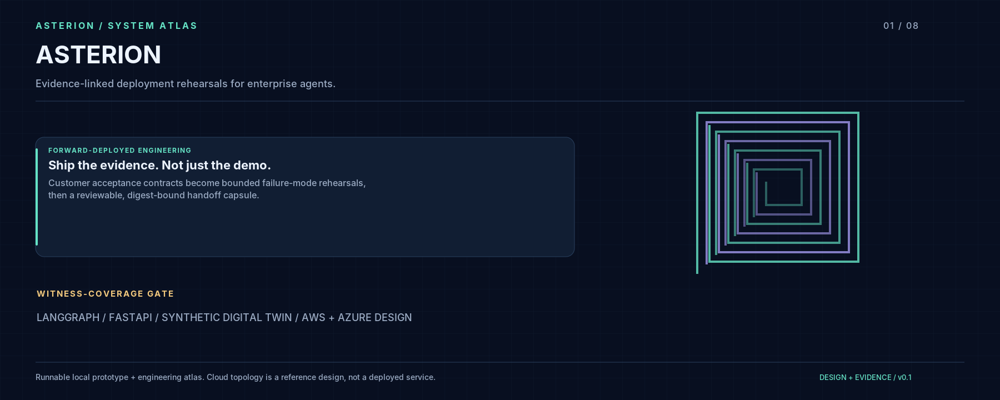
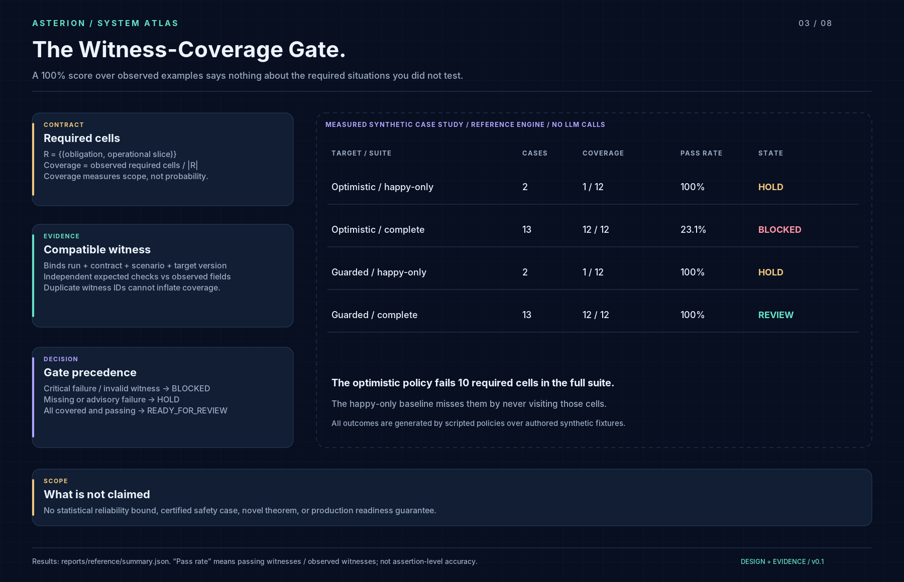

<p align="center"></p>

# ASTERION
### Evidence-linked deployment rehearsals for enterprise agents

**A perfect demo score is not a customer handoff.** ASTERION converts a customer acceptance contract into bounded operational rehearsals, verifies obligation-linked evidence, and produces a digest-bound human-review capsule.

[](https://github.com/gandhiashutosh14/asterion-rehearsal/actions/workflows/ci.yml)   

**Maturity:** working local research/engineering prototype. **Default:** no API key, synthetic fixtures, no cloud writes. **Framework:** a native LangGraph engine that shares its domain nodes with the default reference runner. **License:** MIT.

**Verified before publishing (2026-09-17, Windows 11, Python 3.11):** 73 tests passed with none skipped, including the native LangGraph interrupt/resume tests, at 94% line and branch coverage. The four case studies below reproduced with byte-identical evidence digests. The HTTP API passed a 10-check smoke test under uvicorn, and the built wheel ran outside the source tree. The original packaging sandbox had recorded 70 passed with the LangGraph module skipped. [Records, commands and limits](reports/verification/README.md).

[Start here](START_HERE.md) · [Architecture](docs/ARCHITECTURE.md) · [Visual atlas](docs/DIAGRAMS.md) · [Measured results](reports/reference/README.md) · [Verification scope](docs/IMPLEMENTATION_STATUS.md) · [Engineering handoff](AGENTS.md)

## The 30-second demonstration

Two routine cases pass. Is the customer ready?

| Scripted target | Suite | Required-cell coverage | Observed witness pass rate | Handoff state |
|---|---|---:|---:|---|
| Optimistic | Happy-only | 1 / 12 | 100% | **HOLD** |
| Optimistic | Complete | 12 / 12 | 23.1% | **BLOCKED** |
| Guarded | Happy-only | 1 / 12 | 100% | **HOLD** |
| Guarded | Complete | 12 / 12 | 100% | **PENDING_REVIEW** |

These are **executed synthetic case-study results**, not model accuracy, production reliability, customer savings or an autonomous deployment claim. The optimistic policy is intentionally flawed; the guarded policy implements the authored contract. See [reproduction and source hashes](reports/reference/summary.json).

The central mechanism is the **Witness-Coverage Gate**: a passing normal example cannot discharge an untested outage, freshness, duplicate-event or tenant-boundary obligation. Missing evidence stays missing.



## Run locally

Python 3.11+ is required. A fresh installation needs package-registry access; subsequent reference runs need no network or model key.

```bash
git clone https://github.com/gandhiashutosh14/asterion-rehearsal.git
cd asterion-rehearsal
python -m venv .venv
# Linux/macOS: source .venv/bin/activate
# Windows PowerShell: .venv\Scripts\Activate.ps1
python -m pip install -e ".[api,dev]"
python scripts/demo.py demo
python scripts/benchmark.py --output artifacts/benchmark
python -m pytest -q
python scripts/api_smoke.py        # starts the API under uvicorn on 127.0.0.1, checks it, stops it
```

`scripts/benchmark.py` without `--output` rewrites the committed reference reports under `reports/reference/`; write to `artifacts/` to compare instead.

Open `artifacts/latest/report.html` for your new dossier. For an immediate, installation-free tour, open **`site/index.html`** in a browser; it uses bundled measured reports and does not execute an agent.

To expose the core counterexample:

```bash
python scripts/demo.py demo --suite happy-only --output artifacts/happy-only
python scripts/demo.py demo --profile optimistic --output artifacts/blocked
```

A complete guarded run returns a run ID and evidence digest. Review that exact run with:

```bash
python scripts/demo.py review RUN_ID --digest EVIDENCE_DIGEST --decision approve --rationale "Reviewed the synthetic acceptance evidence"
```

`RUN_ID` and `EVIDENCE_DIGEST` are operator inputs copied from the preceding run, not literal values. Approval changes the local rehearsal status. It never deploys an application or writes to a customer system.

## Native LangGraph mode

```bash
python -m pip install -e ".[api,dev,agent]"
python -m pytest tests/test_langgraph_integration.py -q
python scripts/demo.py demo --engine langgraph --output artifacts/langgraph
```

The adapter uses `StateGraph`, SQLite checkpoints, a conditional bounded rehearsal loop, `interrupt()` and `Command(resume=...)`. The reference runner and framework adapter share the same domain nodes. The three framework tests run in GitHub CI and passed locally on 2026-09-17. In a local CLI run, the LangGraph engine stopped at `PENDING_REVIEW`, and a separate `review` process resumed the interrupt to `APPROVED`. Its cells, witnesses, observations and final status matched a reference-engine run ([log](reports/verification/2026-09-17-local-windows/cli-flows.txt)). The original packaging sandbox could not install LangGraph and skipped these tests.

An optional Bedrock proposer selects allowed scenario IDs. Install `.[cloud]`, configure an enabled Converse-compatible model using `ASTERION_BEDROCK_MODEL_ID` and `AWS_REGION`, then add `--planner bedrock`. This can incur charges. Live inference was not run; SDK serialization was tested using a fake client. The synchronous API intentionally refuses live model planning.

## System architecture


| Component | Responsibility | Code |
|---|---|---|
| Integration Cartographer | Record declared synthetic CRM/ERP context | `workflow.discover` |
| Scenario Architect | Propose bounded catalog IDs, reject invented cases | `planning.py` |
| Rehearsal Fabric | Exercise input-only scripted targets over fixtures | `twin.py` |
| Independent verifier | Compare observations with separate curated checks | `evidence.py` |
| Witness-Coverage Gate | Evaluate coverage, missing cells and counterexamples | `evidence.assess` |
| Handoff Seal | Bind human review to an unchanged evidence payload | `workflow.seal`, `storage.review` |

The subsystem names identify responsibilities, not six independent LLM agents. The architecture deliberately uses one bounded planner/executor/verifier flow rather than unnecessary agent debate.

## Why this is an FDE artifact

The repository covers the customer-delivery seam: discovery questions, explicit acceptance, integration failure semantics, concrete reproduction, reviewer ownership and operational handoff. The [engagement kit](docs/fde/ENGAGEMENT_BRIEF.md), [acceptance workbook](docs/fde/ACCEPTANCE_WORKBOOK.md), [RACI](docs/fde/RACI.md), [ADRs](docs/adr/README.md) and [runbook](docs/RUNBOOK.md) make the engineering discussion inspectable.

AWS/Azure diagrams are **reference targets**, not deployed services. [AWS Terraform](infra/aws/README.md) supplies only registry/evidence/IAM foundation resources. The working local API uses server-mapped bearer principals, SQLite and stored-journal SSE replay, not SSO, a production queue or live token streaming.

## Included assets

Eight architectural plates, each as editable SVG and high-resolution PNG, plus Mermaid source. A branded hero, a local interactive report explorer, actual browser screenshots, typed JSON schemas/OpenAPI, case-study reports, security/operations documents, Docker recipes and CI workflows are included. Start with the [visual atlas](docs/DIAGRAMS.md). The screenshots were captured in the packaging environment on 2026-09-16; `site/index.html` is unchanged since then.

## Claims and limitations

The gate demonstrates finite, explicitly authored acceptance coverage. It is not a reliability probability, formal proof, patentability opinion or certification. Hashes detect changed content; they do not authenticate a malicious evaluator. The model never sees golden expected values, but all catalog data is public and was authored for this project. No real customer data, employer source, credential or outreach tracker is bundled.

This project is distinct from rule-change decision replay, schema-drift repair, resource scheduling, general multi-judge evaluation and infrastructure root-cause diagnosis. Its unit of value is a **customer-specific deployment handoff capsule**.

## Repository map

```text
src/asterion/       Typed contracts, planning, fixtures, gate, ledger, API, LangGraph
src/asterion/data/  Synthetic contract and independently authored expected checks
tests/             Core, API, persistence and optional native-framework tests
scripts/           Demo, benchmark, API smoke test, dossier verifier, schema/site/diagram generators
reports/           Reference case-study results with source hashes; dated verification records
assets/            Editable vector diagrams, raster exports and browser captures
site/              Offline interactive case-study explorer
schemas/           JSON Schema and OpenAPI exports
docs/              Architecture, research, security, operations and FDE delivery kit
infra/aws/         Unapplied foundation Terraform (not a full service deployment)
.github/workflows/ Tests and packaging on every push; Terraform checks on infra changes; manual container/image workflows
AGENTS.md          Bounded continuation and publication instructions for coding agents
```

## Sources and authorship

See [sources](docs/SOURCES.md) for official framework/cloud references and readiness-review prior art. See [development notes](docs/DEVELOPMENT_NOTES.md) for what was checked, fixed and changed before publication. Part of Ashutosh Gandhi's independent portfolio; no company endorsement or production adoption is implied.
