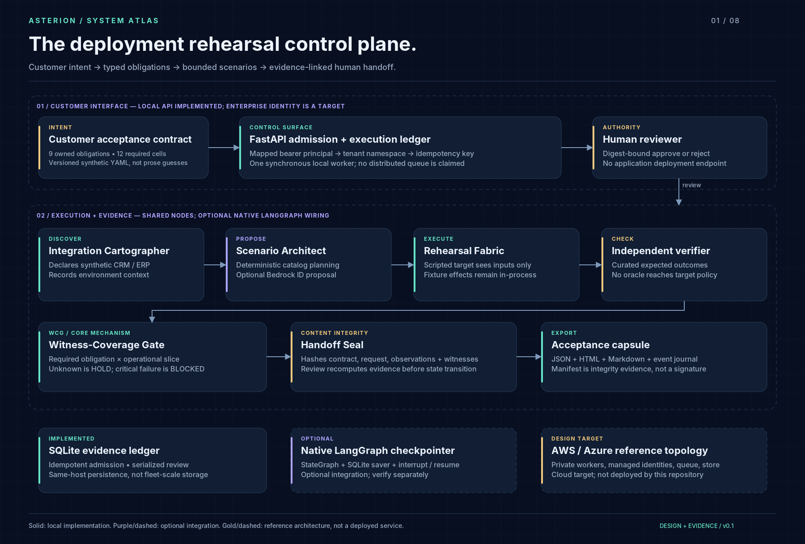
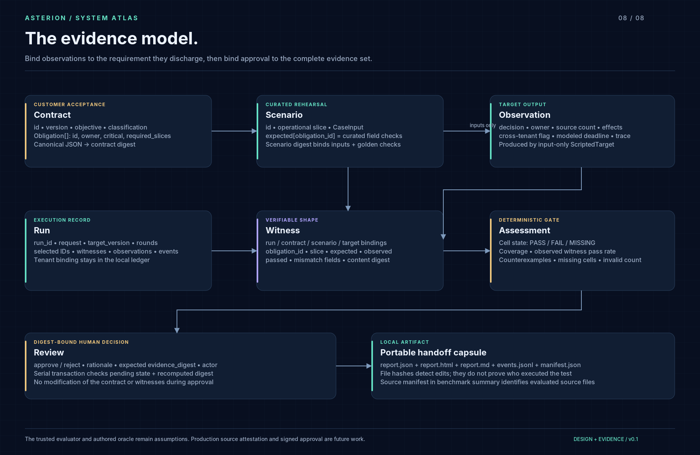
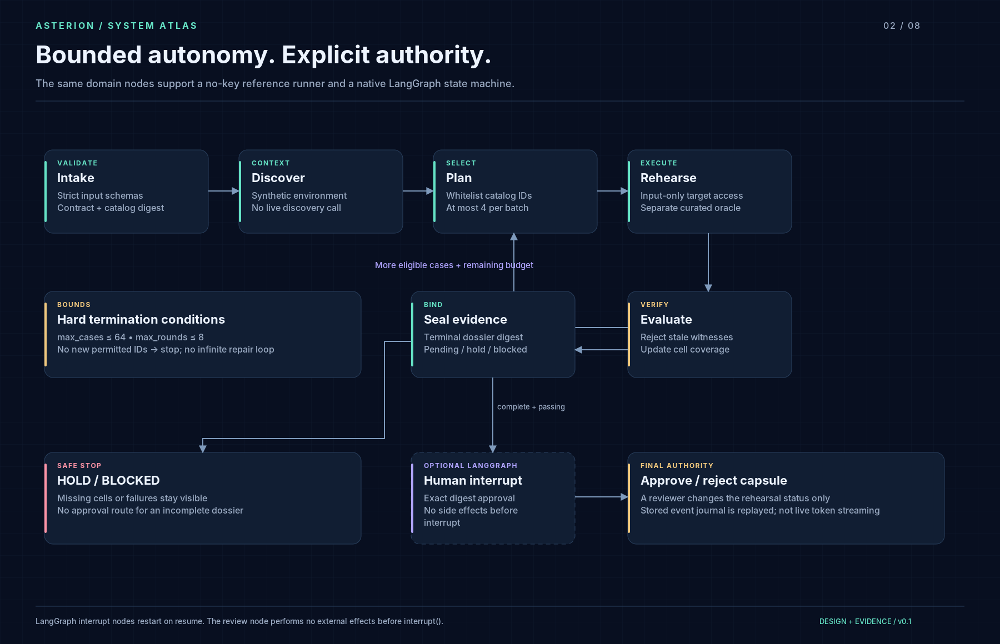

# ASTERION architecture dossier

**Evidence-linked deployment rehearsals for enterprise agents.** A customer-specific acceptance gate, not a general agent framework, policy-replay engine, schema repairer, or autonomous SRE.

## 1. The deployment problem

A support agent can look convincing in a routine demonstration while failing exactly where a customer implementation becomes difficult: a missing source record, a stale snapshot, an unavailable dependency, a duplicate webhook, a cross-tenant identifier, or an escalation with no owner. A single success percentage mixes these situations together—or omits them entirely. The customer still needs a defensible handoff: what was required, what was tested, what failed, who owns the gap, and what exactly a reviewer accepted.

ASTERION treats that handoff as a first-class artifact. A typed acceptance contract declares obligations and operational slices. A bounded planner selects authored scenarios. A synthetic target is exercised without seeing the evaluation oracle. An independent verifier records compatible witnesses. The Witness-Coverage Gate refuses to equate missing evidence with success. Approval binds to the exact collected evidence.

Production-readiness reviews and requirements traceability are established practice, not inventions claimed here. Google's [SRE engagement model](https://sre.google/sre-book/evolving-sre-engagement-model/) motivates the importance of early operational requirements and readiness assessment. ASTERION is an original implementation of a narrow agent-delivery workflow; originality of the underlying mechanism has not been established by a comprehensive prior-art review.

## 2. Personas and authority

The customer sponsor states the business decision and acceptable behavior. The FDE converts ambiguous requirements into a versioned contract and executable examples. The integration owner declares dependencies and failure semantics. The platform/security reviewer checks the boundary. A named reviewer accepts or rejects a completed rehearsal dossier. These are responsibility divisions; the demo API implements only `viewer`, `operator` and `reviewer` roles.

The API derives tenant identity from a server-configured bearer-token mapping. A request cannot select its tenant. The local CLI trusts the machine's user and is not a separation-of-duties system. Token configuration is a development control, not SSO. Customer identity, secrets and production records do not ship in this repository.

## 3. Domain entities

`Contract` owns a finite set of `Obligation` records. Each obligation declares an owner, criticality and required slices. `Scenario` owns a `CaseInput` and separate expected observation checks keyed by obligation. `Observation` is the target's measurable output. `Witness` binds observed checks to contract digest, scenario digest, target version and run. `Assessment` retains PASS, FAIL or MISSING for every required cell. `ReviewRequest` binds the decision to the evidence digest.

The bundled contract has nine obligations and twelve required cells. Thirteen cases include two normal examples; repeating a normal case does not create a new outage witness. These numbers describe the authored fixture catalog, not the breadth of a production evaluation program.

## 4. Runtime and component responsibilities

**Integration Cartographer** is the name of the discovery node. In v0.1 it records the declared synthetic CRM/ERP context. It does not crawl APIs, inspect databases or infer schemas. Live inventory discovery is a future adapter responsibility.

**Scenario Architect** selects IDs from the eligible catalog. The deterministic policy prioritizes cases attached to critical obligations. An optional Bedrock proposer can select from the same catalog. The compiler drops unknown IDs, deduplicates repeats and caps each batch at four cases. Model suggestions cannot add tools, alter an oracle or authorize deployment.

**Rehearsal Fabric** executes a scripted `guarded` or deliberately `optimistic` policy against in-process fixtures. It receives only `CaseInput`. The guarded policy checks tenant scope before source access, verifies availability/freshness/identity, routes higher-impact work to review, assigns fallback ownership and deduplicates a local effect. These are demo behaviors, not evidence of a model's judgment.

**Independent verifier** compares specific observed fields with the curated oracle. It produces a witness even when the check fails. Assertions are not generated by the tested policy, and the optional model does not see their expected values. Independence here means code/data separation, not independently collected real-world labels: all fixtures were authored for this package.

**Witness-Coverage Gate** validates bindings and computes the finite cell matrix. An incompatible witness is a blocker rather than silently discarded. A duplicated witness does not create more coverage. A critical failure blocks. Missing cells or noncritical failures hold. Full passing coverage proceeds to review, not production.

**Handoff Seal** hashes the contract, run request, target identifier, witnesses, observations and assessment. The reviewer supplies that digest; the ledger recomputes it before recording approval. Local JSON/HTML/Markdown and a replayable event journal form the portable capsule.

## 5. Agent model and execution topology

State contains request, contract, catalog, completed and selected IDs, observations, witnesses, assessment, rounds, evidence digest and terminal status. Actions are selecting permitted scenario IDs, rehearsing selected inputs, verifying outputs, continuing within limits, sealing and requesting human review. The planner has no arbitrary shell, browser, network or external-write tool.

A bounded planner/executor/verifier arrangement is enough. Multiple autonomous debating agents would add cost and shared-error paths without improving this fixture-level acceptance contract. Specialist names express component responsibilities, not a claim that every node is a separate LLM.

The reference runner invokes shared Python nodes directly and is the default no-key mode. The native LangGraph adapter wires those nodes into `StateGraph`, uses a SQLite checkpointer, and places `interrupt()` only after a complete passing assessment. It resumes using the same thread ID and `Command(resume=...)`. LangGraph documents that interrupted nodes restart on resume; the review node therefore has no external effects before the interrupt. See [LangGraph interrupts](https://docs.langchain.com/oss/python/langgraph/interrupts).

## 6. Termination and failure behavior

A run is bounded by a maximum of 64 cases and eight rounds, with defaults of 32 and four. Each round selects at most four cases. Repeated selections cannot rerun completed cases. A proposal with no new permitted IDs ends in the evidence state actually achieved, usually HOLD. Invalid model JSON raises an error instead of being repaired indefinitely. Live model calls have SDK connect/read timeouts; there is no unbounded model retry loop.

The runtime continues collecting diagnostics after a failing fixture if budget remains. It does not keep retrying the target until it passes. A fresh run is required for changed policies, contracts or cases. The gate cannot authorize incomplete evidence. Human rejection is recorded as REJECTED; approval means only that this rehearsal capsule was accepted.

## 7. Persistence, concurrency and recovery

The local ledger uses SQLite WAL and a unique `(tenant, idempotency_key)` constraint. Creation is serialized with a write transaction. Reusing an idempotency key with identical request returns the original run; changing the request conflicts. Reviews check pending state and evidence digest in one serialized transaction, so concurrent reviews cannot both succeed.

This intentionally simple design holds the ledger transaction while the bounded run executes. It is inappropriate for a high-throughput or long-running production service. The API consequently rejects live model planning. The CLI can opt into live planning but should not be used concurrently as a multi-tenant service.

LangGraph checkpoints and the application ledger are separate SQLite databases. There is no distributed transaction between them. A crash between checkpoint completion and ledger commit can leave an orphaned checkpoint. Recovery tooling, atomic admission/outbox and worker leases are target architecture, not shipped guarantees. Do not enable multiple replicas on copied local databases.

The local fixture's effect idempotency models a duplicate within a case. It does not guarantee exactly-once effects across a real connector, network retries or process crashes. Live adapters must make those semantics explicit and reconcile ambiguous outcomes.

## 8. Security and observability

The main boundaries are client-to-principal, model-to-catalog, target-to-oracle, witness-to-gate and reviewer-to-evidence. HTML output escapes variable content. API responses disable caching and framing. No generic command execution, dynamic plugin loading or production connector is present. The fixture note case checks data handling by a scripted policy; it does not measure prompt-injection resistance against a language model.

The event journal records workflow stages and outcomes, not private model reasoning. Optional OpenTelemetry spans wrap major nodes and avoid raw notes and credentials. OTLP export was not exercised against a collector during packaging. The SSE endpoint replays a stored journal after a run; it is not live token streaming or a distributed event bus.

Content hashes support integrity checks. They do not authenticate the target binary, sign a reviewer identity, prevent an evaluator from fabricating evidence, or prove that a golden label is correct. The target version is an explicit identifier, not a measured binary attestation. The benchmark also records source-file hashes for inspection.

## 9. Deployment and evolution

The first useful production extension is not “more agents.” It is one narrowly scoped real target adapter with independent customer-approved expected outcomes, plus application identity and durable job execution. Preserve the gate's separation of proposal, execution, verification and authority while making those seams operational.

The [AWS/Azure target](CLOUD_ARCHITECTURE.md) shows queue-backed workers, managed state, customer-scoped object evidence, workload identities and operational ownership. AWS foundation Terraform creates only a subset of resources. No cloud environment was provisioned and no live customer traffic was used.

For detailed limitations and verification scope, read [implementation status](IMPLEMENTATION_STATUS.md), [threat model](THREAT_MODEL.md), [research framing](RESEARCH_NOTE.md), and [runbook](RUNBOOK.md).
