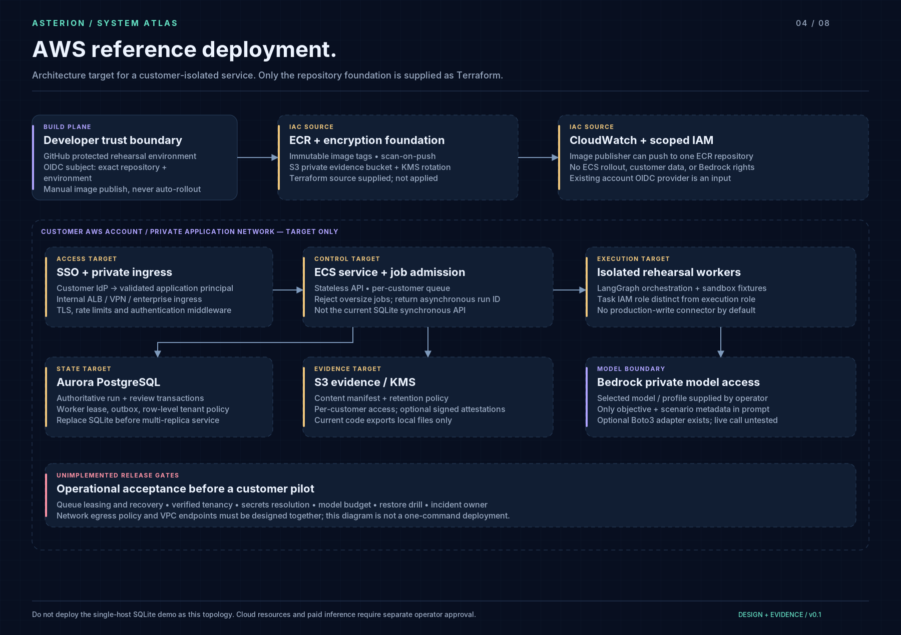
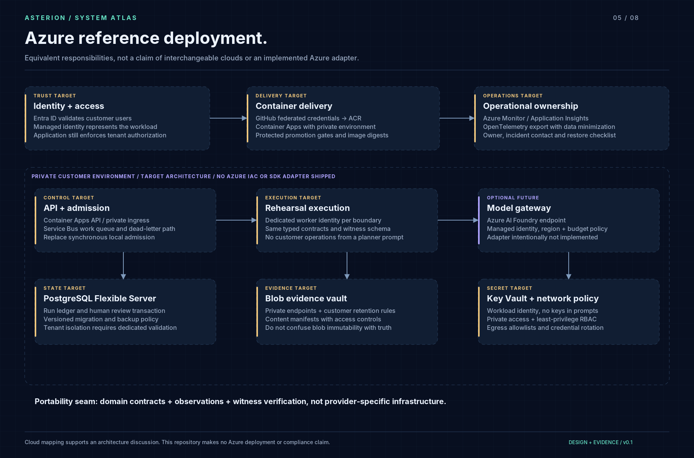

# Cloud reference architecture

**Status: design target, not a deployed service.** The runnable product slice is a local synchronous rehearsal with SQLite. AWS foundation source is supplied separately. Azure is a responsibility mapping, not an SDK adapter or Terraform deployment.

## AWS: private, customer-scoped deployment target

The delivery boundary uses GitHub OIDC, a protected environment and an ECR-only publisher role. A separate approved promotion process would deploy a digest-pinned image. The application should use its own ECS task role; image pulling and infrastructure bootstrap should not share its data/model privileges. AWS documents the task-role boundary in [ECS task IAM roles](https://docs.aws.amazon.com/AmazonECS/latest/developerguide/task-iam-roles.html). GitHub documents audience/subject restrictions in [OIDC with AWS](https://docs.github.com/en/actions/how-tos/secure-your-work/security-harden-deployments/oidc-in-aws).

An enterprise ingress would validate customer identity and map it to server-controlled tenant context. The API admits a bounded job and returns a run ID. A queue with explicit visibility timeout, dead-letter routing and a worker lease would feed isolated rehearsal workers. The database would own run state, review state and the admission transaction. An outbox or equivalent would bridge committed admission to message delivery. Each effectful adapter must define idempotency across worker retries; a graph checkpoint alone does not provide this.

Aurora PostgreSQL is a proposed replacement for the local ledger, with schema migration, backups, tested restore, least-privilege roles, tenant access policy and review-concurrency validation. The native LangGraph SQLite checkpoint integration also needs an appropriate production saver. These changes must be implemented together; copying the SQLite file into multiple ECS tasks is not an upgrade path.

Evidence objects would live under a customer-scoped S3 policy, with KMS permissions separate from image-publishing permissions. Retention and deletion are contractual decisions. Integrity hashes detect changed bytes, while signed attestations and controlled signing identities address origin; neither proves that an oracle is correct. Content-addressed storage does not substitute for access control.

The optional Bedrock proposer has a small input boundary: objective text, missing-cell identifiers and the permitted scenario catalog. It does not receive expected results or raw fixture notes. The supplied Boto3 adapter uses explicit request timeouts and no model-output repair loop. A real multi-tenant service still needs asynchronous admission, token/currency budgets, cancellation, structured usage reporting and an approved data-egress policy. The current API intentionally refuses live model planning; the CLI allows an explicitly configured call.

Private subnets alone do not establish controlled outbound access. Model endpoints, registry pulls, logging, identity endpoints and dependency installation require a reviewed route or endpoint policy. No network boundary in this document is claimed to exist in the local prototype.

## Azure: equivalent responsibilities, explicit differences

| Responsibility | AWS target | Azure target | Repository implementation |
|---|---|---|---|
| Image registry | ECR | ACR | Docker recipe; AWS ECR IaC only |
| Workload compute | ECS | Container Apps | Local FastAPI / CLI only |
| Workload identity | ECS task role | Managed identity | No cloud workload identity runtime |
| Job transport | SQS | Service Bus | No queue; local bounded synchronous run |
| Authoritative ledger | Aurora PostgreSQL | PostgreSQL Flexible Server | SQLite |
| Evidence objects | S3 + KMS | Blob + Key Vault | Local files + SHA-256 manifest |
| Model proposer | Bedrock Converse | Azure AI Foundry | Optional Bedrock adapter only |
| Observability | CloudWatch / OTLP | Monitor / Application Insights | Event journal and optional OTLP spans |

Azure managed identity authenticates a workload to supported resources; it does not automatically represent or authorize each application user. Role assignments and tenant checks remain necessary. See [Microsoft's managed identity documentation](https://learn.microsoft.com/en-us/azure/container-apps/managed-identity).

## Pilot entry gates, not performance claims

Before a real customer pilot: validate identity and tenancy, implement queue/lease recovery, exercise provider timeouts, document data retention, inject a worker crash, restore state in a clean environment, reconcile ambiguous connector effects and obtain a named operator. Measure p95 run duration, queue delay, provider cost per run, failed-run rate and human-review latency. No numeric SLO or cloud-cost estimate is asserted by this repository: collect workload and account-region evidence first.

## Infrastructure verification ladder

1. Static source review and secret scan.
2. Terraform format/validate with pinned provider lock file.
3. Reviewed sandbox plan and cost estimate.
4. Controlled apply with least-privilege bootstrap identity.
5. Identity, networking, upload and restore smoke tests.
6. Controlled teardown and evidence of deleted resources.

Only the first level was considered during packaging; no cloud resources were provisioned. Sources were consulted on 2026-09-16. Provider support and organization policies must be rechecked at deployment time.
