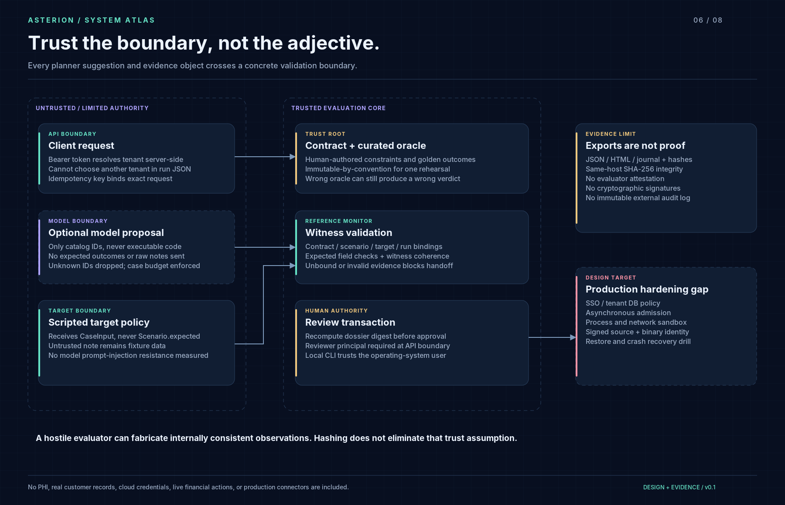

# Threat model and trust boundaries

## Assets and trusted components

Protect tenant-scoped rehearsal records, reviewer authority, expected outcomes, API credentials and honest representation of evidence. The Python process, operating-system account, local database, catalog author and verifier are trusted. This prototype does not defend against a malicious database administrator, compromised host or falsifying evaluator.

| Threat | Implemented control | Residual gap / verification |
|---|---|---|
| Caller guesses another tenant's run ID | Server token mapping + tenant-scoped lookup | Tested 404; token distribution and SSO are not implemented |
| Viewer creates or approves a run | Operator/reviewer role gates | Tested; same reviewer may also operate, so not strict separation of duties |
| Duplicate API submission | Unique scoped idempotency key and request digest | Tested under concurrency; SQLite serialization limits throughput |
| Model invents a tool or scenario | Catalog-only IDs, deduplication, hard case cap | Unit-tested; no model robustness study |
| Target sees its golden answers | Execute receives only `CaseInput` | Code/data separation; fixtures remain public to a malicious author |
| Evidence from another version/run is reused | Contract/scenario/target/run binding checks | Tested; target version string is trusted, not binary attestation |
| File changes after export | SHA-256 manifest verifier | Detects edits relative to manifest; attacker can replace manifest too |
| Evidence changes before approval | Recompute sealed payload in review transaction | Tested; malicious host can rewrite state and digest |
| Two simultaneous approvals | Serialized pending-state transition | Tested locally; no distributed review protocol |
| HTML inserted into dossier fields | HTML escaping for variable text | Tested; no external scripts in dossier |
| Sensitive data leaks to a planner | No oracle or raw fixture notes in Bedrock brief | Only synthetic objective/catalog allowed; no general PII detection claim |
| Unbounded retry/cost | Case/round bounds, catalog authority, SDK timeouts | No dollar budget; live model path is CLI-only |
| Synthetic effect mistaken for real connector guarantee | Explicit in-process fixture scope | Cross-process connector semantics not implemented |

## Scope exclusions

No real production connector, cloud write, deployment endpoint, browser-control tool, shell tool or arbitrary code executor is supplied. The API has no production authorization provider, rate limiter, background queue, durable external audit system, encryption-at-rest configuration or multi-replica semantics. An authenticated caller can submit many bounded jobs and exhaust local service capacity; put no untrusted traffic on this prototype.

The untrusted-note fixture is not an adversarial LLM benchmark. The scripted target ignores notes, so the result demonstrates data separation only. Never advertise an attack-success-rate reduction from this case.

## Human approval

Approval accepts a synthetic evidence capsule, not a launch, payment or production mutation. A real deployment service must define a separate release authority, signed evidence identity, freshness requirement, change scope, rollback conditions and customer owner. Customer sign-off does not by itself establish security or regulatory compliance.

## Reporting an issue

Use the repository's private security reporting feature if enabled by the owner. Otherwise send a minimal non-sensitive report through the owner's publicly listed GitHub contact route. Do not paste credentials, customer records or exploit output into a public issue. There is no response-time SLA for this portfolio prototype.
